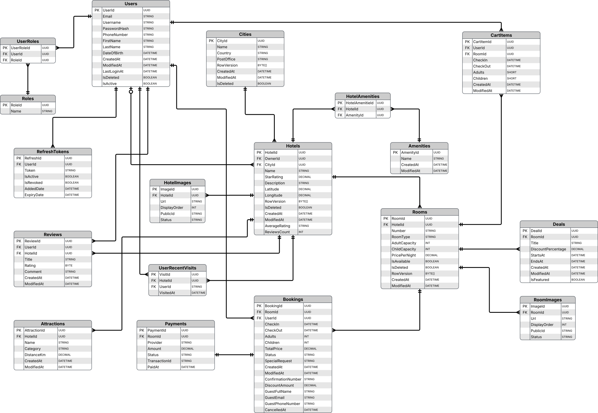
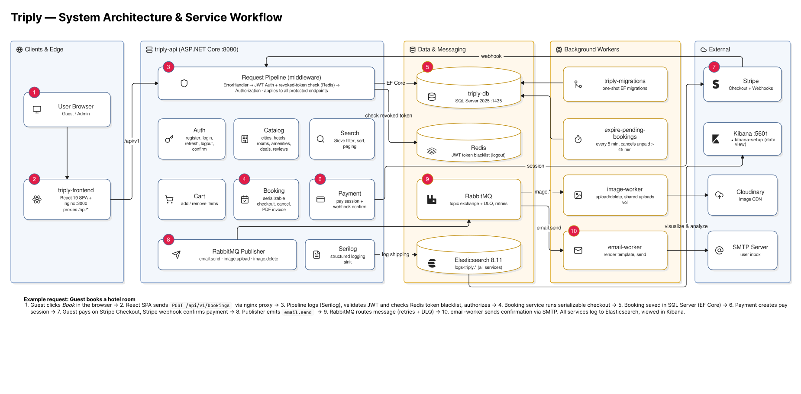

# Triply

Triply is a hotel-booking platform. Guests search rooms by date, manage a cart, create bookings and payments, download invoices, and review hotels after a completed stay. Administrators manage cities, hotels, rooms, images, amenities, attractions, and deals.

---
## Tech stack

| Area | Technologies |
| --- | --- |
| Frontend | React 19, TypeScript, Vite, React Router, TanStack Query, React Hook Form, Zod, Axios, Tailwind CSS, Lucide icons, Sonner notifications |
| API | ASP.NET Core Minimal APIs on .NET 10, OpenAPI/Swagger, Serilog |
| Architecture | Clean Architecture: Domain, Application, Infrastructure, API; repository and service layers; validation decorators via Scrutor |
| Authentication | ASP.NET Core Identity, JWT Bearer access tokens, refresh-token cookie authentication, role-based authorization |
| Persistence | Entity Framework Core 10, SQL Server 2025, EF Core migrations, EFCore.BulkExtensions |
| Querying and token revocation | Sieve filtering/sorting/pagination; Redis via StackExchange Redis for the JWT access-token blacklist |
| Messaging and workers | RabbitMQ, EmailWorker, ImageUploader worker, pending-booking expiry worker |
| External services | Stripe Checkout and webhooks, Cloudinary image hosting, SMTP email, QuestPDF invoice generation |
| Observability | Serilog structured logging, Elasticsearch, Kibana, request correlation IDs, health checks |
| Testing | xUnit, Moq, EF Core InMemory/SQLite, ASP.NET Core `WebApplicationFactory`, Coverlet |
| Local orchestration | Docker, Docker Compose, SQL Server, Redis, RabbitMQ Management, Elasticsearch, Kibana |

---
### Main capabilities

- Date-range room availability and overlap protection for pending and confirmed bookings.
- Cart, checkout, booking cancellation, payment, Stripe webhook handling, and PDF invoices.
- Hotel, room, city, amenity, attraction, deal, and image management.
- Background email delivery and asynchronous Cloudinary uploads.
- Verified reviews: only guests with a completed stay can review; hotel guest ratings are recalculated and stored after review changes.
- Admin dashboard plus public hotel search, browsing, reviews, and recent-visit features.

---
## Requirements

Use Docker Engine 24+ with Docker Compose v2 for the complete local system. Keep at least 8 GB RAM available and ensure ports `3000`, `8080`, `8081`, `1435`, `5672`, `6379`, `9200`, `5601`, and `15672` are free. Frontend-only development also requires Node.js 22+ and npm. Running the API, workers, or tests outside Docker requires the .NET 10 SDK.

Stripe, Cloudinary, and SMTP credentials are only required for real payments, uploads, and email. Set `PROVIDER_ID=Mock` for a basic local payment flow.

---
## ERD



---
## System architecture and service workflow




Workflow: frontend calls the API; the API stores data in SQL Server and checks the Redis JWT blacklist for revoked access tokens; email and image tasks are published to RabbitMQ; workers send SMTP emails and upload images to Cloudinary; the expiry worker cancels unpaid pending bookings; payments use Mock or Stripe Checkout, with Stripe finalizing through the webhook.

---
## Quick start with Docker

1. Create the local environment file: `cp .env.example .env`.
2. Edit `.env` and replace all sample secrets. Leave `PROVIDER_ID=Mock` for the first run.
3. Start the platform: `docker compose up -d --build`.
   4. Open frontend: http://localhost:3000 .API health: http://localhost:8080/health. Swagger in Development: http://localhost:8080/swagger. RabbitMQ: http://localhost:15672. Kibana: http://localhost:5601.
5. Stop it with `docker compose down`.

The `triply-migrations` container applies pending migrations before the API starts. Run `docker compose down -v` only when you intentionally want to delete local SQL Server, Redis, RabbitMQ, Elasticsearch, and temporary-upload data.

---
## Frontend development

Keep the Docker backend running, then execute: `cp frontend/.env.example frontend/.env`, `cd frontend`, `npm install`, and `npm run dev`.

`frontend/.env` controls the Vite API proxy; its default target is `http://localhost:8080`. Run `npm run typecheck` or `npm run build` for validation and production output.

---
## Environment variables

Copy [`.env.example`](.env.example) to `.env`. Do not commit `.env`.

| Group | Purpose |
| --- | --- |
| `MSSQL_*`, `TRIPLY_DB_CONNECTION` | SQL Server and application database connection |
| `SECRETKEY`, `ISSUER`, `AUDIENCE`, `VALIDATE_*` | JWT authentication |
| `RABBITMQ_*` | Exchanges, queues, retries, dead-letter queues |
| `REDIS_PASSWORD` | Redis authentication for the JWT token blacklist |
| `SMTP_*` | Booking and account email delivery |
| `CLOUDINARY_*`, `UPLOADS_*` | Asynchronous image upload |
| `PROVIDER_ID`, `CURRENCY`, `STRIPE_*` | Mock or Stripe payment configuration |
| `BOOKING_*` | Pending-booking expiry worker |
| `ELASTICSEARCH_ENABLED`, `SIEVE_*` | Logging and query defaults |

For Stripe locally, forward events with: `stripe listen --events checkout.session.completed,payment_intent.succeeded,payment_intent.payment_failed --forward-to http://localhost:8080/api/v1/payments/webhook`. Put the generated `whsec_...` value in `STRIPE_WEBHOOK_SECRET` and restart the API.

---
## Using the API

All routes start with `http://localhost:8080/api/v1`. Swagger at http://localhost:8080/swagger has the complete contract in Development. Responses use `data`, `message`, `code`, and `errors` fields.

### Search

`curl "http://localhost:8080/api/v1/search?checkIn=2026-11-10&checkOut=2026-11-13&adults=2&rooms=1"`

### Register and log in

```bash
curl -X POST http://localhost:8080/api/v1/auth/register -H "Content-Type: application/json" -d '{"firstName":"Jane","lastName":"Doe","email":"jane@example.com","phoneNumber":"+970591234567","password":"SecurePassword123!"}'
curl -i -c cookies.txt -X POST http://localhost:8080/api/v1/auth/login -H "Content-Type: application/json" -d '{"email":"jane@example.com","password":"SecurePassword123!"}'
export TOKEN='<access-token>'
```

### Cart, booking, payment, invoice

```bash
curl -X POST http://localhost:8080/api/v1/cart/items -H "Authorization: Bearer $TOKEN" -H "Content-Type: application/json" -d '{"roomId":"<room-guid>","checkIn":"2026-11-10","checkOut":"2026-11-13","adults":2,"children":0}'
curl -X POST http://localhost:8080/api/v1/bookings -H "Authorization: Bearer $TOKEN" -H "Content-Type: application/json" -d '{"firstName":"Jane","lastName":"Doe","email":"jane@example.com","phoneNumber":"+970591234567"}'
curl -X POST "http://localhost:8080/api/v1/bookings/<confirmation-number>/pay" -H "Authorization: Bearer $TOKEN"
curl -L "http://localhost:8080/api/v1/bookings/<confirmation-number>/invoice" -H "Authorization: Bearer $TOKEN" --output invoice.pdf
```

`/pay` confirms immediately with Mock, or returns a Stripe Checkout URL with Stripe.

### Upload an image

`curl -X POST "http://localhost:8080/api/v1/hotels/<hotel-guid>/images" -H "Authorization: Bearer $TOKEN" -F "file=@./hotel.jpg"`

Uploads are queued and processed by the image worker. Administrative endpoints require an administrator; use Swagger for schemas, filters, and all available routes.

---
## Useful commands

| Purpose | Command |
| --- | --- |
| Start in background | `docker compose up --build -d` |
| API logs | `docker compose logs -f triply` |
| Image worker logs | `docker compose logs -f image-worker` |
| Email worker logs | `docker compose logs -f email-worker` |
| Run migrations | `docker compose up --build triply-migrations` |
| Unit tests | `cd src && dotnet test --filter "Category!=ApiTests&Category!=IntegrationTests"` |

---
## Project layout

```text
Triply/
├── frontend/                                  # React client application
│   ├── src/
│   │   ├── api/                               # HTTP clients per API resource
│   │   ├── components/                        # Shared UI, layout, admin, and hotel components
│   │   ├── features/                          # Feature hooks and state (auth, cart)
│   │   ├── pages/                             # Public, booking, and admin routes
│   │   ├── services/                          # Client-side API orchestration
│   │   └── types/                             # TypeScript API/domain models
│   ├── .env.example                           # Vite development proxy template
│   ├── package.json                           # Frontend commands and dependencies
│   └── Dockerfile                             # Production frontend image
├── src/
│   ├── Triply.Api/                            # ASP.NET Core host
│   │   ├── Endpoints/                         # Minimal API endpoint mappings
│   │   ├── DependencyInjection/               # API composition and Redis blacklist registration
│   │   ├── Middleware/                        # Error handling and HTTP pipeline behavior
│   │   └── Program.cs                         # Application entry point
│   ├── Triply.Application/                    # Application layer
│   │   ├── Features/                          # Commands, queries, and validators by feature
│   │   ├── DTOs/                              # API request/response data contracts
│   │   ├── Interfaces/                        # Repository and service abstractions
│   │   └── Options/                           # Typed configuration options
│   ├── Triply.Domain/                         # Domain layer
│   │   ├── Entities/                          # Hotel, room, booking, payment, review, identity entities
│   │   ├── Enums/                             # Domain states and classifications
│   │   └── Contracts/                         # Cross-service message contracts
│   ├── Triply.Infrastructure/                 # Infrastructure layer
│   │   ├── Db/                                # EF Core DbContext
│   │   ├── Configurations/                    # EF Core entity mappings
│   │   ├── Migrations/                        # SQL Server schema migrations
│   │   ├── Repositories/                      # EF Core persistence implementations
│   │   ├── Services/                          # Booking, payment, auth, invoice, review services
│   │   ├── Payments/                          # Mock and Stripe payment gateways
│   │   └── Routes/                            # Central API route definitions
│   └── Triply.Tests/                          # Unit, API, and integration tests
│       ├── UnitTests/
│       ├── ApiTests/
│       └── IntegrationTests/
├── workers/
│   ├── EmailWorker/                           # RabbitMQ consumer that sends SMTP email
│   ├── ImageUploader/                         # RabbitMQ consumer that uploads to Cloudinary
│   └── ExpirePendingBookings/                 # Hosted worker that expires unpaid bookings
├── libraries/
│   ├── Logging/                               # Shared Serilog / Elasticsearch logging setup
│   └── MessageQueue/                          # Shared RabbitMQ publisher and consumer abstractions
├── docker-compose.yml                         # Entire local environment and dependencies
├── src/Dockerfile                             # API image
├── src/Dockerfile.Migrations                  # One-shot EF migration image
├── .env.example                               # Docker environment template
└── README.md                                  # Project documentation
```
---
## Troubleshooting

- Container fails: use `docker compose logs <service>` and check its matching `.env` values.
- Images stay Pending: check RabbitMQ, `image-worker`, Cloudinary values, and shared `UPLOADS_PATH`.
- Stripe stays Pending: verify forwarding to `/api/v1/payments/webhook` and `STRIPE_WEBHOOK_SECRET`.
- Email is missing: inspect `email-worker` logs and verify `SMTP_*`.